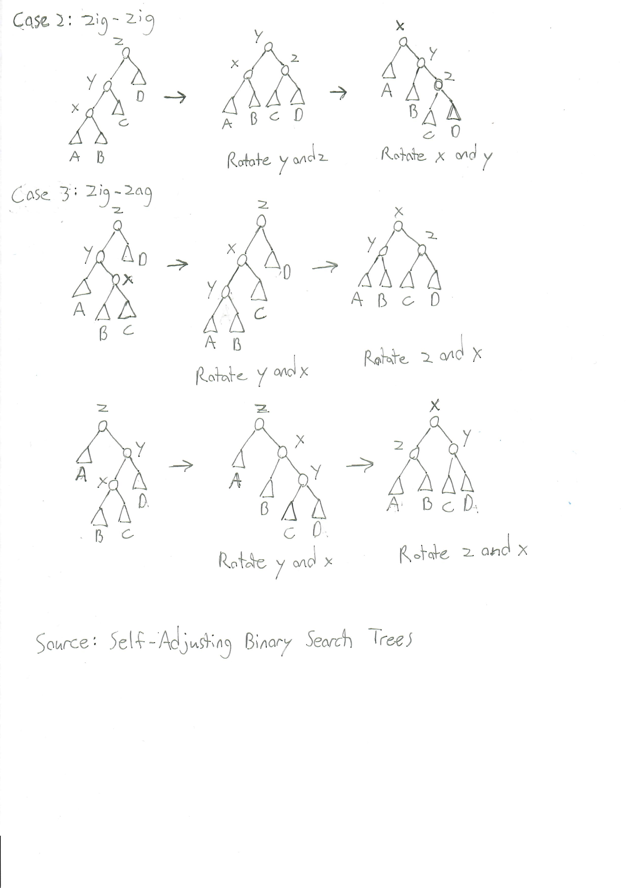
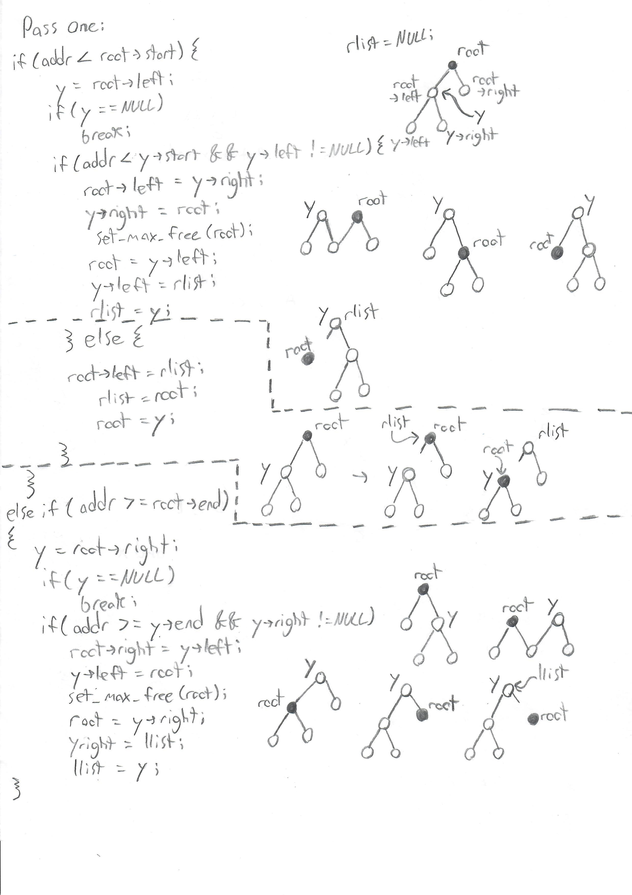
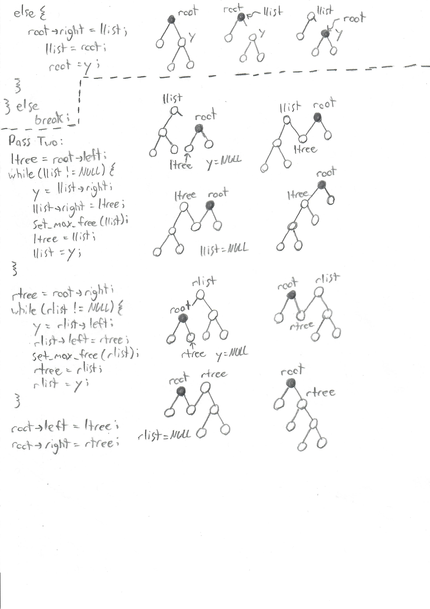
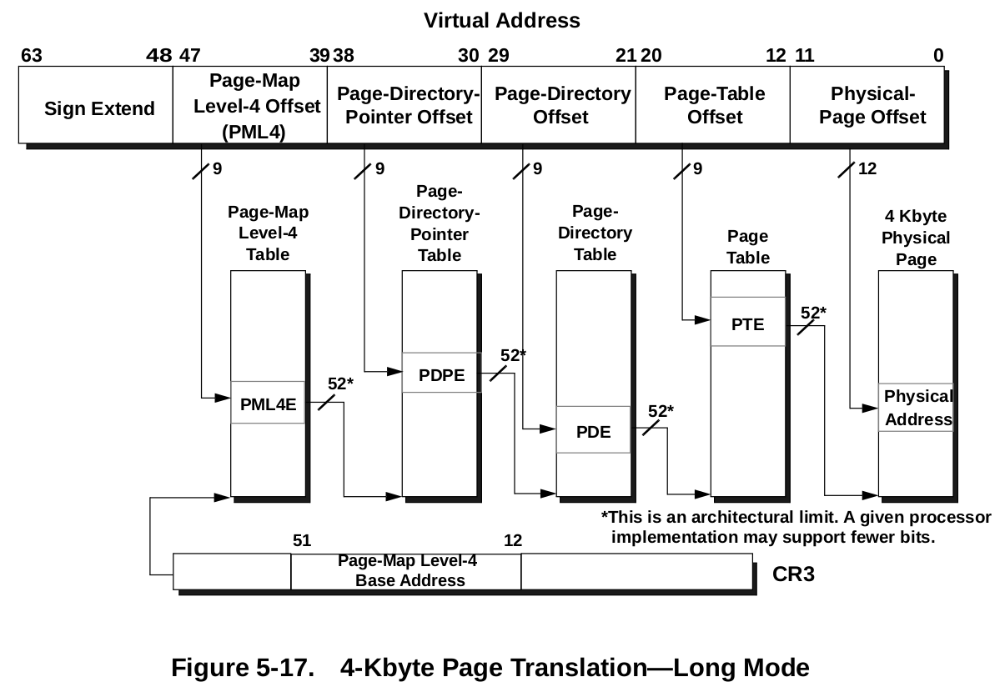
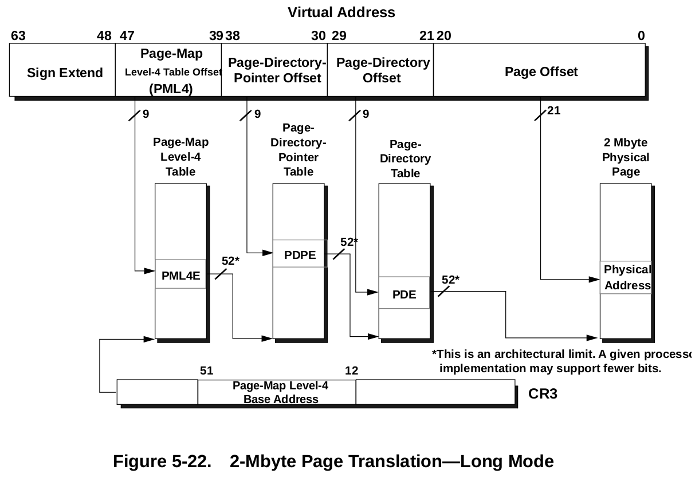

# Walkthrough of FreeBSD 11's Memory Map System Call

## Contents

1. Code Flow
2. Reading Checklist
3. Important Data Structures
4. Code Walkthrough

## Code Flow

This section describes the code flow in four level deep tree structure.
Each level of the tree corresponds to a function call with its own
unique stack frame, where the only exception is for one-liner functions
that call a function within a return.

```txt
sys_mmap
	fget_mmap
	vn_mmap
		vm_mmap_vnode
			vm_pager_allocate
				vnode_pager_alloc
					vm_object_allocate
						_vm_object_allocate
		vm_mmap_object
			vm_map_find
				vm_map_findspace
					vm_map_entry_splay
			vm_map_insert
				vm_map_lookup_entry
				vm_map_entry_create
				vm_map_entry_link
					vm_map_entry_splay
					vm_map_entry_set_max_free
				vm_map_simplify_entry
				vm_map_pmap_enter
					vm_page_find_least
					pmap_enter_object
						pmap_ps_enabled
						pmap_enter_pde
						pmap_enter_quick_locked
							pmap_valid_bit
							pmap_pde_pindex
							pmap_pde
								pmap_pdpe
									pmap_pm14e
										pmap_pml4e_index
										pmap_pml4e_to_pdpe
									pmap_pdpe_to_pde
										pmap_pde_index
							_pmap_allocpte
								pmap_accessed_bit
								pmap_modified_bit
								pmap_valid_bit
								pmap_rw_bit
								vm_page_alloc
								PHYS_TO_VM_PAGE
						pmap_try_insert_pv_entry
						pte_store
```

## Reading Checklist

This section lists the relevant functions for the walkthrough by filename,
where each function per filename is listed in the order that it is called.

The first '+' means that I have read the code or have a general idea of what it does.
The second '+' means that I have read the code closely and heavily commented it.
The third '+' means that I have added it to this document's code walkthrough.

```txt
File: vm_mmap.c
	sys_mmap					+---
	vm_mmap_vnode				++--
	vm_mmap_object				++--

File: kern_descrip.c
	fget_mmap					++--

File: vfs_vnops.c
	vn_mmap						+---

File: vm_pager.c
	vm_pager_allocate			++--

File: vnode_pager.c
	vnode_pager_alloc			++--

File: vm_object.c
	vm_object_allocate			+---
	_vm_object_allocate			+---

File: vm_map.c
	vm_map_find					++--
	vm_map_findspace			++--
	vm_map_entry_splay			++--
	vm_map_insert				++--
	vm_map_lookup_entry			+---
	vm_map_entry_create			++--
	vm_map_entry_link			++--
	vm_map_entry_set_max_free	++--
	vm_map_simplify_entry		+---
	vm_map_pmap_enter			++--

File: vm_page.c
	vm_page_find_least			----
	PHYS_TO_VM_PAGE				++--
	vm_page_alloc				----

File: vm_radix.c
	vm_radix_lookup_ge			----

File: pmap.c
	pmap_enter_object			++--
	pmap_ps_enabled				----
	pmap_enter_pde				----
	pmap_enter_quick_locked		++--
	pmap_valid_bit				++--
	pmap_pde_pindex				++--
	pmap_pde					++--
	pmap_pdpe					++--
	pmap_pml4e					++--
	pmap_pml4e_index			++--
	pmap_pml4e_to_pdpe			++--
	pmap_pdpe_index				++--
	pmap_pdpe_to_pde			++--
	pmap_pde_index				++--
	_pmap_allocpte				++--
	pmap_accessed_bit			++--
	pmap_modified_bit			++--
	pmap_valid_bit				++--
	pmap_rw_bit					++--
	pmap_try_insert_pv_entry	----

File: pmap.h
	pte_store					----
```

## Important Data Structures and Algorithms

### Splay Tree Rotations



### *vm\_map\_entry\_splay* Visualization





### *kva\_md\_info* Structure

```c
/* From /sys/vm/vm.h */

/*
 * Information passed from the machine-independant VM initialization code
 * for use by machine-dependant code (mainly for MMU support)
 */
struct kva_md_info {
	vm_offset_t	buffer_sva;
	vm_offset_t	buffer_eva;
	vm_offset_t	clean_sva;
	vm_offset_t	clean_eva;
};

extern struct kva_md_info	kmi;
```

### *pmap* Structure

```c
/*
 * The kernel virtual address (KVA) of the level 4 page table page is always
 * within the direct map (DMAP) region.
 */
struct pmap {
	struct mtx		pm_mtx;
	pml4_entry_t		*pm_pml4;	/* KVA of level 4 page table */
	uint64_t		pm_cr3;
	TAILQ_HEAD(,pv_chunk)	pm_pvchunk;	/* list of mappings in pmap */
	cpuset_t		pm_active;	/* active on cpus */
	enum pmap_type		pm_type;	/* regular or nested tables */
	struct pmap_statistics	pm_stats;	/* pmap statistics */
	struct vm_radix		pm_root;	/* spare page table pages */
	long			pm_eptgen;	/* EPT pmap generation id */
	int			pm_flags;
	struct pmap_pcids	pm_pcids[MAXCPU];
};
```

### 4 KiB Page Mapping in Long Mode



### 2 MiB Page Mapping in Long Mode



## Code Walkthrough

### Pseudo Code Overview 

**sys_mmap**: Aligns file position on a page boundary, rounds size up to a multiple of PAGE\_SIZE, calls fget\_mmap to obtain the file entry pointer, and calls vn\_mmap.

1. Enforces mmap's constraints for old binaries and/or anonymous mappings
2. Checks flags for illegal bits or invalid settings
3. Aligns the file position on a page boundary and adds its remainder modulo PAGE\_SIZE to size and rounds up
4. Checks if alignment >= 12 bits and fits inside a void pointer
5. Checks that the mapping fits inside user VM space and does not wraparound/overflow
6. Moves the hint to the end of a largest possible data segment if it is between vm\_taddr and vm\_daddr + lim\_max(td, RLIMIT\_DATA)
7. Calls fget\_mmap to obtain a pointer to the file entry
8. Calls vn\_mmap
9. Sets addr + pageoff as the retval and returns the error from either vn\_mmap

**fget_mmap**: Calls \_fget by passing 0 for flags and NULL for seq lock pointer.

**vn_mmap**: Checks that file and memory protections are compatible, sets max protections, calls vm\_mmap\_vnode to obtain the backing object of the file, and calls vm\_mmap\_object to insert the object into the thread's va space.

1. Uses mount point to set VM\_PROT\_EXECUTE (for no exec filesystems)
2. Sets VM\_PROT\_READ and VM\_PROT\_WRITE based on flags
3. Restricts protections to cap\_maxprot with &=
4. Calls vm\_mmap\_vnode to obtain backing object of file
5. Calls vm\_mmap\_object to insert the object into the thread's va space
6. Returns the error value from vm\_mmap\_object

**vm\_mmap\_vnode**: Acquires a lock on the vnode, ensures the object points to the vnode, obtains file attributes to update object size, calls vm\_pager\_allocate and returns its error value.

1. Sets the appropriate lock type based on mapping and memory protections
2. Obtains a lock on the vnode
3. Uses vnode to obtain a pointer to an object
4. Checks if the object points back to the vnode. If it doesn't, we release the vnode and acquire the lock on the vnode it points to
5. Calls VOP\_GETATTR to obtain file attributes
6. Sets object size equal to size specified in file attributes
7. Calls vm\_pager\_allocate to allocate a vnode pager and return the backing object
8. Release the vnode and return vm\_pager\_allocate's error value

**vm\_pager\_allocate**: Calls vnode\_pager\_alloc using the type argument as an index into pagertab and returns its error value.

**vnode\_pager\_alloc**: Obtains a write lock on the vnode's object if it exists or allocates a new one using vm\_object\_allocate if it doesn't, sets its handle if necessary, increments its reference count, releases the write lock and the vnode reference, and returns the object. 

**vm\_object\_allocate**: Zone allocates an object, calls \_vm\_object\_allocate to initialize it, and returns the object.

\_**vm\_object\_allocate**: Initializes its memq tailq and shadow object list, sets flags to 0, sets the size of the object, its generation and reference count to 1, handle, backing object and backing object offset to 0, and returns.

**vm\_mmap\_object**: Checks if the mapping will exceed process resource limits, determines if mmap will search for space, determines how many pages we will prefault if any, determines if we will copy on write, and inserts the mapping with either vm\_map\_find or vm\_map\_fixed.

1. Checks if the mapping will exceed the proc's virtual memory limit or wired memory limit
2. Catches any nonaligned mapping requests from device drivers and fails them
3. Determines whether mmap will search for space and fails any attempt to map on an unaligned address
4. Sets the copy-on-write flags based on the flag settings
5. Sets the strategy for searching for space and calls vm\_map\_find for fitit == 1. Otherwise, inserts the mapping with vm\_map\_fixed
6. Handles the MAP_WIREFUTURE case
7. Converts mach error codes to Unix codes and returns to vn\_mmap

**vm\_map\_find**: Searches for free space in the process's va space starting at the address we passed, expanding its search if necessary after a failed search for optimal space, inserts the mapping at the address it finds using vm\_map\_insert, and returns vm\_map\_insert's return value back to vm_mmap_object.

**vm\_map\_findspace**: Checks if the address fits within the minimum and maximum VM addreses, calls vm\_map\_entry\_splay to retrieve the root node, determines whether the root has enough adjacent space for the mapping and if not searches the appropriate subtrees if their max\_free values are greater than the size of the mapping, sets addr equal to the starting address of the node or its adjacent space, and returns 0 upon success.

**vm\_map\_entry\_splay**: This algorithm is best described and understood using the visual aids in the Important Data Structures and Algorithms section.

**vm\_map\_insert**: Calls vm\_map\_lookup\_entry to obtain the entry preceding the newly inserted entry, determines whether the newly inserted entry's object can be coalesced with the previous and subsequent entry and combines them if possible, creates and inserts the new entry with vm\_map\_entry|_create and vm\_map\_entry\_link respectively, calls vm\_map\_simplify\_entry to try to combine all three entries, calls vm\_map\_pmap\_enter to map the object's in-core pages into the process's va space, and returns KERN\_SUCCESS.

1. Asserts that we are not mapping kernel memory into user va space.
2. Checks for invalid start and end values
3. Calls vm\_map\_lookup\_entry to obtain the vm map entry that will precede the newly inserted entry
4. Checks if the newly inserted entry will overlap with the previous or subsequent entry
5. Determines whether this mapping will be charged by the resource accounting system, reserving swap space the size of the entry if it is
6. Checks if the inserted entry's object can be coalesced into the previous and subsequent entry's object and attempts to combine them if possible
7. Calls vm\_map\_entry\_create to create a new vm map entry
8. Initializes the entry and inserts it into the list with vm\_map\_entry\_link 
9. Updates the size of the vm map
10. Calls vm\_map\_simplify\_entry to attempt to coalesce the previous and subsequent map entries
11. Calls vm\_map\_pmap\_enter to insert the object's in-core pages into the process's va space

**vm\_map\_lookup\_entry**: Attempts to obtain an exclusive lock on the vm map so that it can call vm\_map\_entry\_splay to optimize the search for the preceding entry. Otherwise, it uses a standard binary search tree algorithm to find the entry without modifying the splay tree.

**vm\_map\_entry\_create**: Zones allocates a map entry, using M_NOWAIT for the system map entries and M_WAITOK for user map entries.

**vm\_map\_entry\_link**: Increments the number of entries in the map, inserts the entry into to vm map entry list using standard code, calls vm\)map\_entry\_splay to set the previous entry to the root node so that it can assign the new entry as its right child and the subsequent entry as the new entry's right child, sets the entry's adj\_free space, and updates the max\_free values of each subtree by calling vm\_map\_entry\_set\_max\_free. 

**vm\_map\_entry\_set\_max\_free**: Sets the max\_free value of the entry by first setting it to the entry's adj|_free value and modifying it to the max of the left and right child's max\_free fields if they are larger.

**vm\_map\_simplify\_entry**:

**vm\_map\_pmap\_enter**:

**vm\_page\_find\_least**:

**pmap\_enter\_object**:

**pmap\_enter\_quick\_locked**:

**pmap\_try\_insert\_pv\_entry**:

**pte\_store**:


### Documented Code

```c
```
