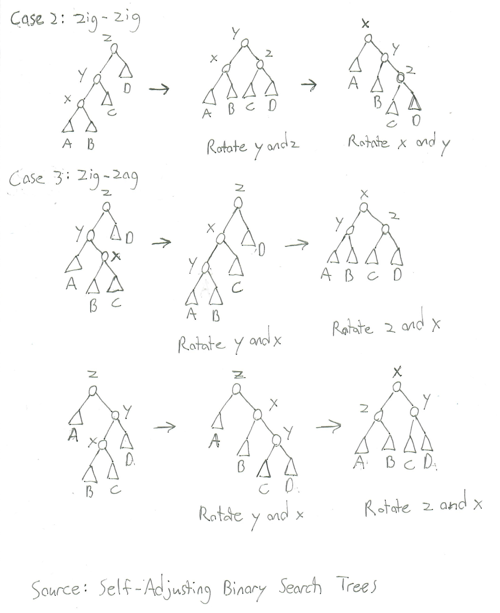

# Walkthrough of FreeBSD 11's Memory Map System Call

## Contents

1. Code Flow
2. Reading Checklist
3. Important Data Structures
4. Code Walkthrough

## Code Flow

This section describes the code flow in four level deep tree structure.
Each level of the tree corresponds to a function call with its own
unique stack frame, where the only exception is for one-liner functions
that call a function within a return.

```txt
sys_mmap
	fget_mmap
	vn_mmap
		vm_mmap_vnode
			vm_pager_allocate
				vnode_pager_alloc
					vm_object_allocate
						_vm_object_allocate
		vm_mmap_object
			vm_map_find
				vm_map_findspace
					vm_map_entry_splay
			vm_map_insert
				vm_map_lookup_entry
				vm_map_entry_create
				vm_map_entry_link
					vm_map_entry_splay
					vm_map_entry_set_max_free
				vm_map_simplify_entry
				vm_map_pmap_enter
					vm_page_find_least
					pmap_enter_object
						pmap_enter_quick_locked
						pmap_try_insert_pv_entry
						pte_store
```

## Reading Checklist

This section lists the relevant functions for the walkthrough by filename,
where each function per filename is listed in the order that it is called.

The first '+' means that I have read the code or have a general idea of what it does.
The second '+' means that I have read the code closely and heavily commented it.
The third '+' means that I have added it to this document's code walkthrough.

```txt
File: vm_mmap.c
	sys_mmap					+---
	vm_mmap_vnode				++--
	vm_mmap_object				++--

File: kern_descrip.c
	fget_mmap					++--

File: vfs_vnops.c
	vn_mmap						+---

File: vm_pager.c
	vm_pager_allocate			++--

File: vnode_pager.c
	vnode_pager_alloc			++--

File: vm_object.c
	vm_object_allocate			+---
	_vm_object_allocate			+---

File: vm_map.c
	vm_map_find					++--
	vm_map_findspace			++--
	vm_map_entry_splay			++--
	vm_map_insert				++--
	vm_map_lookup_entry			+---
	vm_map_entry_create			++--
	vm_map_entry_link			++--
	vm_map_entry_set_max_free	++--
	vm_map_simplify_entry		+---
	vm_map_pmap_enter			++--

File: vm_page.c
	vm_page_find_least			----

File: pmap.c
	pmap_enter_object			----
	pmap_enter_quick_locked		----
	pmap_try_insert_pv_entry	----

File: pmap.h
	pte_store					----
```

## Important Data Structures and Algorithms

### Splay Tree Rotations



### *vm\_map\_entry\_splay* Visualization


## Code Walkthrough

### Pseudo Code Overview 

**sys_mmap**: Aligns file position on a page boundary, rounds size up to a multiple of PAGE\_SIZE, calls fget\_mmap to obtain the file entry pointer, and calls vn\_mmap.

* Enforces mmap's constraints for old binaries and/or anonymous mappings
* Checks flags for illegal bits or invalid settings
* Aligns the file position on a page boundary and adds its remainder modulo PAGE\_SIZE to size and rounds up
* Checks if alignment >= 12 bits and fits inside a void pointer
* Checks that the mapping fits inside user VM space and does not wraparound/overflow
* Moves the hint to the end of a largest possible data segment if it is between vm\_taddr and vm\_daddr + lim\_max(td, RLIMIT\_DATA)
* Calls fget\_mmap to obtain a pointer to the file entry
* Calls vn\_mmap
* Sets addr + pageoff as the retval and returns the error from either vn\_mmap

**fget_mmap**: Calls \_fget by passing 0 for flags and NULL for seq lock pointer.

**vn_mmap**: Checks that file and memory protections are compatible, sets max protections, calls vm\_mmap\_vnode to obtain the backing object of the file, and calls vm\_mmap\_object to insert the object into the thread's va space.

* Uses mount point to set VM\_PROT\_EXECUTE
* Sets VM\_PROT\_READ and VM\_PROT\_WRITE based on flags
* Restricts protections to cap\_maxprot with &=
* Calls vm\_mmap\_vnode to obtain backing object of file
* Calls vm\_mmap\_object to insert the object into the thread's va space
* Returns the error value from vm\_mmap\_object

**vm\_mmap\_vnode**: Acquires a lock on the vnode, ensures the object points to the vnode, obtains file attributes to update object size, calls vm\_pager\_allocate and returns its error value.

* Sets the appropriate lock type based on mapping and memory protections
* Obtains a lock on the vnode
* Uses vnode to obtain a pointer to an object
* Checks if the object points back to the vnode. If it doesn't, we release the vnode and acquire the lock on the vnode it points to
* Calls VOP\_GETATTR to obtain file attributes
* Sets object size equal to size specified in file attributes
* Calls vm\_pager\_allocate to allocate a vnode pager and return the backing object
* Release the vnode and return vm\_pager\_allocate's error value

**vm\_pager\_allocate**: Calls vnode\_pager\_alloc using the type argument as an index into pagertab and returns its error value.

**vnode\_pager\_alloc**: Obtains a write lock on the vnode's object if it exists or allocates a new one using vm\_object\_allocate if it doesn't, sets its handle if necessary, increments its reference count, releases the write lock and the vnode reference, and returns the object. 

**vm\_object\_allocate**: Zone allocates an object, calls \_vm\_object\_allocate to initialize it, and returns the object.

\_**vm\_object\_allocate**: Initializes its memq tailq and shadow object list, sets flags to 0, sets the size of the object, its generation and reference count to 1, handle, backing object and backing object offset to 0, and returns.

**vm\_mmap\_object**: Checks if the mapping will exceed process resource limits, determines if mmap will search for space, determines how many pages we will prefault if any, determines if we will copy on write, and inserts the mapping with either vm\_map\_find or vm\_map\_fixed.

1. Checks if the mapping will exceed the proc's virtual memory limit or wired memory limit
2. Catches any nonaligned mapping requests from device drivers
3. Determines whether mmap will search for space and fails any attempt to map on an unaligned address.
4. Sets the copy-on-write flags based on the flag settings
5. Sets the strategy for searching for space and calls vm\_map\_find for fitit ==1. Otherwise, inserts the mapping with vm\_map\_fixed
6. Handles the MAP_WIREFUTURE case
7. Converts mach error codes to Unix codes and returns to vn\_mmap.

**vm\_map\_find**:

**vm\_map\_findspace**:

**vm\_map\_entry\_splay**:

**vm\_map\_insert**:

**vm\_map\_lookup\_entry**:

**vm\_map\_entry\_create**: Zones allocates a map entry, using M_NOWAIT for the system map entries and M_WAITOK for user map entries.

**vm\_map\_entry\_link**:

**vm\_map\_entry\_splay**:

**vm\_map\_entry\_set\_max\_free**:

**vm\_map\_simplify\_entry**:

**vm\_map\_pmap\_enter**:

**vm\_page\_find\_least**:

**pmap\_enter\_object**:

**pmap\_enter\_quick\_locked**:

**pmap\_try\_insert\_pv\_entry**:

**pte\_store**:


### Documented Code

```c
```
